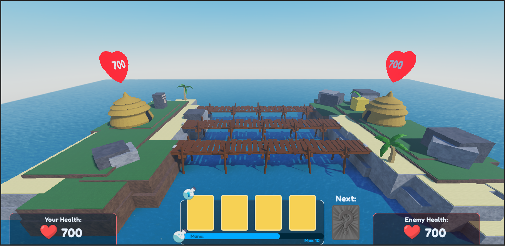

# Luminth

A fast, real‑time **3D Clash Royale–style arena battler** built in **Roblox**. Play across **three bridges (lanes)**, deploy unit and spell **cards** using **mana**, and outsmart your opponent to **destroy their towers** before they destroy yours.

**Status:** Partial code drop for portfolio (not immediately runnable).
**Why:** Proprietary/large assets and project-specific file structure are excluded.

## What this shows
- Core game/logic modules I wrote
- Networking/state systems
- Key patterns: (e.g., server-authoritative actions, data-driven configs)

## What’s missing
- Assets: models, textures, audio (`/Assets`)  
- Private services / API keys  
- Full project structure (tooling/workspace files)


# ✨ Highlights

- **3 Bridges (Lanes):** Classic left / center / right pathing for lane strategy.
- **Card Summoning:** Drag‑and‑drop (or click) to deploy units and cast spells.
- **Tower Destruction:** Chip away at enemy defenses; win by taking their main base.
- **Real‑Time PvP:** Head‑to‑head matches with quick decision making.
- **Clean UI:** Health, mana bar, card queue, and “next card” preview.
- **Optimized for Roblox:** Lightweight assets and performant Lua systems.

# 🎮 How to Play

1. **Queue into a match** and spawn in on your island.
2. **Earn mana over time** (up to a max cap). Stronger cards cost more mana.
3. **Select a card** in your hand and **place it into a lane** (one of the three bridges).
4. **Units auto‑path** toward enemy towers. Use spells/support to swing trades.
5. **Destroy the enemy’s main tower** to win the match.

# 🃏 Cards & Mana (Core Concepts)

- **Hand:** A rotating set of cards. When you play one, a new card enters the queue.
- **Costs:** Every card consumes **mana**; manage timing to avoid being starved.
- **Unit Types:** Melee, ranged, splash, tank, and utility.
- **Spells:** Direct damage, stuns, slows, heals, or area control (as available).

# 🧭 Controls

- **PC:** Click a card to select → click a valid tile/lane to deploy.
- **Gamepad / Mobile:** Tap/select a card → tap the map to deploy.

# 🛠️ Tech Notes

- **Engine:** Roblox (Luau)
- **Gameplay Systems:** Card deck/queue, mana regen, lane pathing, tower AI, health/damage
- **UI:** Health hearts, mana bar with cap, hand of cards, next card preview
- **Networking:** Server‑authoritative spawning and combat resolution (typical Roblox pattern)

# 📂 Suggested Project Structure

```
/src
  /client            # UI, input
  /server            # spawning, combat, towers
  /shared            # constants, card defs, types
/media               # screenshots and promo assets
README.md
```

# 🗺️ Roadmap

- More unit/spell cards
- Deck builder & matchmaking
- Emotes/taunts and cosmetics
- Replays and spectate mode
- Ranked ladder and seasons

# 📝 License

MIT (or your preferred license).

# 🙌 Credits

Built by **LumintH Studios**.
